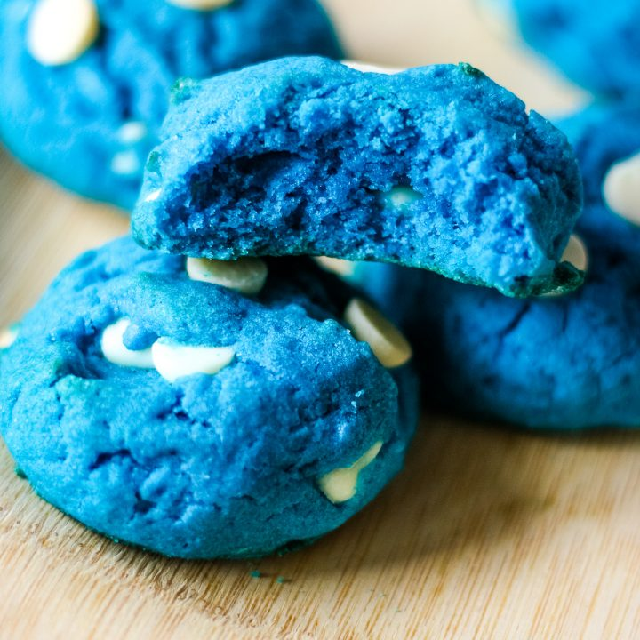

*"I recoiled at the taste, because I was expecting apple juice. It wasn’t that at all. It was chocolate-chip cookies. Liquid cookies. And not just any cookies – my mom’s homemade blue chocolate-chip cookies, buttery and hot, with the chips still melting."*\
The lightening Theif, By Rick Riordan 

## **Ingredients:**

* 2 cups all-purpose flour 
* 1 teaspoon baking soda 
* ½ teaspoon salt 
* 1 cup (2 sticks) butter, softened 
* ¾ cup granulated sugar
* ¾ cup packed brown sugar
* 2 teaspoons vanilla extract 
* 2 large eggs 
* 1 cup semi-sweet chocolate chips 
* 1 cup white chocolate chips 
* 1 cup blue chocolate chips 
* Blue food colouring

## **Method:**

1. Preheat oven to 375°F. Line baking sheets with parchment paper. 
2. In a medium bowl, whisk together the flour, baking soda, and salt; set aside. 
3. In a large bowl, beat together the butter, granulated sugar, brown sugar, and vanilla extract with an electric mixer until creamy. Beat in the eggs and 3-4 drops of food colouring. 
4. Gradually add the flour mixture, beating until just combined. 
5. Stir in the chocolate chips, white chocolate chips, and blue chocolate chips. 
6. Drop dough by rounded tablespoonfuls onto the prepared baking sheets. 
7. Bake for 8 to 10 minutes, or until golden. Cool on the baking sheets for 5 minutes, then transfer to a wire rack to cool completely.