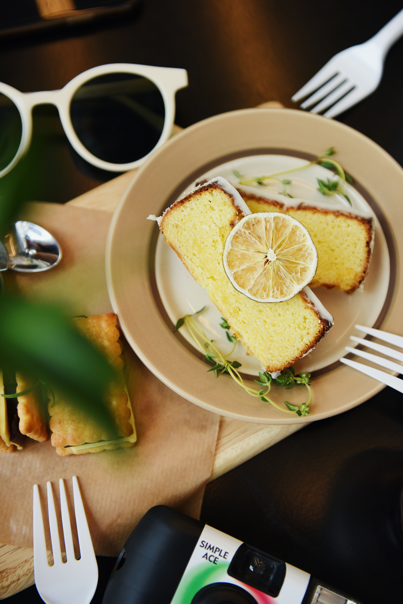

*Together we scrutinized the twelve lemon cakes from the delicatessen shop.*

*“Will they do?” I asked.*

*“Of course, of course! They’re fine!” and he added hollowly, “…old sport.”*

The Great Gatbsy. By, F. Scott. Fitzgerlad

**Ingredients:**

* 2 cups all-purpose flour
* 2 teaspoons baking powder
* 1/2 teaspoon salt
* 1/2 cup (1 stick) unsalted butter, at room temperature 
* 1 cup granulated sugar
* 2 large eggs, at room temperature
* 1/2 cup buttermilk
* 2 tablespoons freshly squeezed lemon juice 
* 2 teaspoons pure lemon extract 
* 1 teaspoon pure vanilla extract 
* Zest of 1 lemon

**Method:**

1. Preheat oven to 350 degrees F. Line a 12-cup muffin tin with paper liners.
2. In a medium bowl, whisk together the flour, baking powder, and salt.
3. In a large bowl, beat the butter and sugar together until light and fluffy, about 3 minutes. Beat in the eggs, one at a time, until combined.
4. In a small bowl, whisk together the buttermilk, lemon juice, lemon extract, and vanilla extract
5. Add the dry ingredients to the wet ingredients in three batches, alternating with the buttermilk mixture. Beat until just combined.
6. Fill each muffin cup about two-thirds full with batter. Sprinkle with the lemon zest.
7. Bake for 18-20 minutes, or until a toothpick inserted into the center of a cupcake comes out clean.
8. Cool the cupcakes in the pan for 5 minutes, then transfer to a wire rack to cool completely.
9. Frost with your favorite frosting and enjoy!